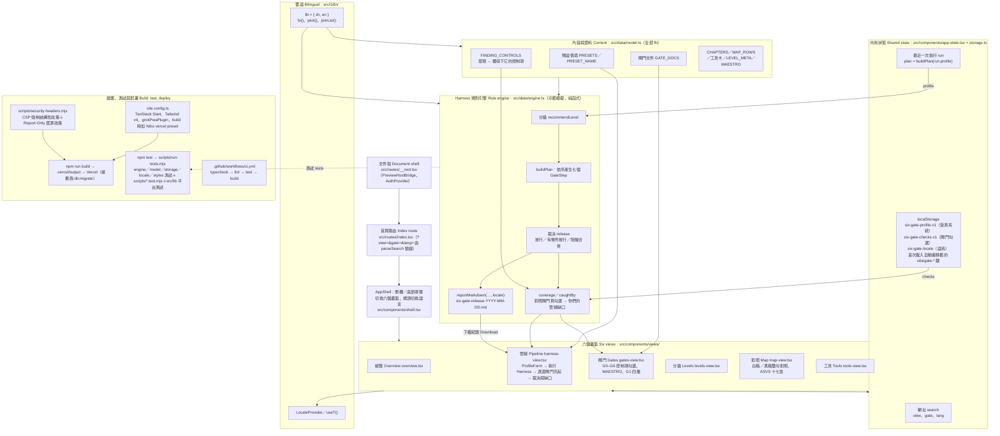

# 六扇門（Six-Gate for Vibe Code）

> 本文件中英對照：每一節先正體中文、後 English。
> This document is bilingual: each section is written in Traditional Chinese first, then in English.

把 Vibe Coding 的資安測試整理成「G0 威脅建模 + G1–G6 六道閘門」的互動教學工具，對齊 OWASP ASVS 5.0.0。設計期、白箱、黑箱與 AI 紅隊各有一道關卡，Harness 把它們串成一次放行裁決。介面提供正體中文與英文切換（預設中文）。

An interactive teaching tool that organizes security testing for vibe coding into "G0 threat modeling + six gates G1–G6", aligned with OWASP ASVS 5.0.0. Design-time, white-box, black-box and AI red-team each get a gate, and the Harness chains them into one release verdict. The UI switches between Traditional Chinese and English (Chinese by default).

> Harness 是**示範模擬**：發現項與證據是依你選的情境產生的教學範例，不會掃描任何真實系統。章節對照是教學摘要，正式驗證以標準原文為準。
>
> The Harness is a **demo simulation**: findings and evidence are teaching examples generated from the scenario you pick; nothing real is scanned. Chapter references are a teaching summary; verify against the standard itself.

## 🏛️ 系統架構與流程 / Architecture Overview

整個系統跑在瀏覽器裡：TanStack Start 負責殼與路由，`app-state.tsx` 管狀態，`model.ts` 放內容，`engine.ts` 是 Harness 的純函式規則引擎。沒有自己的 API、沒有模型呼叫、不掃描任何真實系統；部署時由 Nitro 做伺服器端渲染，並載入平台的 PWA 中介層（`server/`）。

Everything runs in the browser: TanStack Start provides the shell and routing, `app-state.tsx` holds state, `model.ts` holds content and `engine.ts` is the Harness's pure-function rule engine. There is no API of its own, no model call and no real scanning; on deploy Nitro renders server-side and loads the platform's PWA middleware (`server/`).



## 畫面 / Views

| 畫面 View | 內容 Content |
| --- | --- |
| 總覽 Overview | 會被 AI 生成速度放大的缺陷、事故對到閘門、ASVS 5.0 等級比例<br/>Defects that generation speed amplifies, incidents mapped to gates, ASVS 5.0 level shares |
| 管線 Pipeline | 設定受測系統，執行 Harness，看各閘門裁決、放行紀錄與「你們的管線缺口」<br/>Configure the system under test, run the Harness, see each gate's verdict, the release record and "your pipeline gaps" |
| 閘門 Gates | G0–G6 的時機、對抗對象與控制項清單；勾選代表你們真實的管線已有該控制<br/>When each of G0–G6 runs, what it defends against, its control checklist; a check means your real pipeline has that control |
| 分級 Levels | L1／L2／L3 的意義、建議等級與在 Harness 裡的效果<br/>What L1 / L2 / L3 mean, the recommended level and its effect in the Harness |
| 對照 Map | 白箱與黑箱的雙向對照，以及 ASVS 十七章<br/>The two-way white-box / black-box map and the seventeen ASVS chapters |
| 工具 Tools | SAST、SCA、DAST、AI 紅隊工具的定位與限制<br/>Where SAST, SCA, DAST and AI red-team tools fit, and their limits |

畫面、閘門與語系寫在網址裡（例如 `?view=gates&gate=G3&lang=en`），可以直接分享；中文是預設值，不會出現在網址。受測系統設定、勾選與語系只存在瀏覽器的 localStorage，舊版 `vibegate-*` 鍵會在第一次載入時自動搬到 `six-gate-*`。

View, gate and locale live in the URL (for example `?view=gates&gate=G3&lang=en`) so links can be shared; Chinese is the default and stays out of the URL. The system settings, checks and locale are stored only in the browser's localStorage; the old `vibegate-*` keys are migrated to `six-gate-*` on first load.

## 雙語怎麼做 / How the bilingual UI works

所有顯示文字都是 `Bi = { zh, en }`（`src/i18n/locale.ts`）。內容（`model.ts`）、規則引擎輸出（`engine.ts` 的發現、日誌、裁決、放行紀錄）與各畫面頂端的 `T` 字典全部成對儲存，型別會強制兩種語言都有。畫面用 `useT()` 取字；`reportMarkdown` 多一個 `locale` 參數。語系來源依序是網址 `?lang=`、localStorage、預設中文，切換時同步 `<html lang>`。

Every display string is a `Bi = { zh, en }` (`src/i18n/locale.ts`). Content (`model.ts`), rule-engine output (findings, logs, verdicts and the release record in `engine.ts`) and the per-view `T` dictionaries are all stored as pairs, and the type forces both languages. Views call `useT()`; `reportMarkdown` takes an extra `locale` argument. The locale comes from `?lang=` in the URL, then localStorage, then the Chinese default, and `<html lang>` follows it.

## Harness 的規則 / Harness rules

規則都在 `src/data/engine.ts`，重點如下：

- **分級**：對外且有個資、致命三要素未切斷、破壞性工具沒有人工核可，任一項成立就是 L3；有個資、有 LLM、超出內部使用或有 Agent 則是 L2；其餘 L1。
- **致命三要素**（私有資料、不受信任內容、對外通訊）只在有 LLM 或 Agent 時成立。沙箱或出向允許清單可以切斷一腳，人工核可不算。未切斷時 G0 與 G6 都阻擋。
- **破壞性工具**只認人工核可，沙箱不能取代。
- **示範程式的狀態**分三段：仍有缺陷、剩縱深項（只剩 CSP 強制、重設密碼限速這類警示）、已整治。
- **L3 的縱深項**（IMDSv2、CSP、規則檔掃描、速率限制、內部端點的配額）一律升為阻擋；L1／L2 只警示。公開端點完全沒有配額則不分等級都阻擋；預備環境的 API 文件外洩不是縱深項，各等級都維持警示。
- **未文件化的威脅模型**在 L3 阻擋，其他等級警示。
- **管線缺口**：每個發現都對到攔得下它的控制項（`FINDING_CONTROLS`），任一項在閘門頁已勾就算你們的管線涵蓋。

The rules live in `src/data/engine.ts`:

- **Level**: public with personal data, an uncut lethal trifecta, or destructive tools without human approval each force L3; personal data, an LLM, exposure beyond internal use or an agent give L2; everything else is L1.
- **Lethal trifecta** (private data, untrusted content, egress) only counts with an LLM or agent. A sandbox or egress allow-list cuts a leg; human approval does not. While uncut, G0 and G6 both block.
- **Destructive tools** accept only human approval; a sandbox is no substitute.
- **Demo code state** has three stages: still defective, depth items left (only advisories such as enforced CSP and password-reset rate limits), remediated.
- **Depth items at L3** (IMDSv2, CSP, rule-file scanning, rate limits, quotas on internal endpoints) escalate to blocks; L1 / L2 only warn. A public endpoint with no quota at all blocks at every level; API docs exposed in staging are not a depth item and stay an advisory at every level.
- **An undocumented threat model** blocks at L3 and warns elsewhere.
- **Pipeline gaps**: every finding maps to the controls that would catch it (`FINDING_CONTROLS`); any one checked on the gates page counts as covered.

## 📦 目錄結構 / Directory layout

儲存庫名稱仍是 `G0withSixGates`，產品名稱是「六扇門 Six-Gate for Vibe Code」（`package.json` 的 name 為 `six-gate-for-vibe-code`）。

The repository is still called `G0withSixGates`; the product is "六扇門 Six-Gate for Vibe Code" (`package.json` name `six-gate-for-vibe-code`).

```text
G0withSixGates/
├── src/
│   ├── brand.ts                    # 專案名稱與一句話說明 / project name and one-line description
│   ├── i18n/
│   │   ├── locale.ts               # Bi 型別、bi()、pick()、joinList() 等 / Bi type and helpers
│   │   ├── locale.test.ts
│   │   └── context.tsx             # LocaleProvider、useLocale()、useT()
│   ├── routes/
│   │   ├── __root.tsx              # 文件殼 / document shell：head、樣式、<PreviewHostBridge />、<AuthProvider>
│   │   └── index.tsx               # 唯一頁面 / the single page；parseSearch 驗證 ?view=&gate=&lang=
│   ├── components/
│   │   ├── shell.tsx               # AppShell：標頭、語言切換、側欄與底部導覽 / header, language switch, nav
│   │   ├── app-state.tsx           # 共用狀態 / shared state：網址參數、localStorage、最近一次執行與 plan
│   │   ├── storage.ts(.test.ts)    # 安全的 localStorage 讀寫與 vibegate-* → six-gate-* 搬移 / safe storage + migration
│   │   ├── profile-form.tsx        # 受測系統設定表單 / system-under-test form
│   │   ├── ui.tsx                  # Panel、Badge、按鈕、Choice、ToggleRow
│   │   ├── preview-host-bridge.tsx # 平台 platform：Grok 即時預覽的 postMessage 橋接
│   │   └── views/                  # 六個畫面 / six views
│   │       ├── overview.tsx        #   總覽 Overview
│   │       ├── harness-view.tsx    #   管線 Pipeline：執行 Harness、裁決、缺口、下載紀錄
│   │       ├── gates-view.tsx      #   閘門 Gates：G0–G6 控制項勾選、MAESTRO、G1 四層
│   │       ├── levels-view.tsx     #   分級 Levels
│   │       ├── map-view.tsx        #   對照 Map
│   │       └── tools-view.tsx      #   工具 Tools
│   ├── data/
│   │   ├── model.ts                # 內容與資料（全部 Bi）/ content and data (all Bi)
│   │   ├── model.test.ts           # 雙語完整性、控制項 id、parseSearch、displayName
│   │   ├── engine.ts               # Harness 規則 / rules：分級、發現、裁決、管線涵蓋、放行紀錄
│   │   └── engine.test.ts          # 規則測試，含所有設定組合的不變條件 / invariants over every profile
│   ├── lib/
│   │   ├── error-component.tsx     # 錯誤畫面（雙語，含重新整理）/ error screen (bilingual, with reload)
│   │   ├── not-found-component.tsx # 找不到頁面 / not-found screen
│   │   ├── og/site.json            # 分享卡片設定 / share-card settings
│   │   ├── auth/、app-data/、db.ts、env.server.ts、multiplayer/、preview-*.ts
│   │   │                           # 平台預置助手 / platform helpers：本 app 未啟用 auth 與 db
│   ├── styles.css                  # Tailwind v4 與色彩 tokens
│   ├── styles.test.ts              # 文字與元件對比度 / contrast tests
│   ├── router.tsx                  # getRouter()，掛上錯誤與找不到頁面 / error + not-found components
│   ├── routeTree.gen.ts            # TanStack Router 自動產生 / generated
│   └── zod-jitless.ts              # 平台 platform：zod 設定
├── scripts/
│   ├── run-tests.mjs               # npm test：scripts/*.test.mjs 與 src/**/*.test.ts
│   ├── security-headers.mjs        # 正式建置的安全標頭 / production security headers（含測試）
│   ├── og-card.mjs                 # 重製 public/og.jpg / regenerate the share card
│   ├── with-app-env.mjs、app-env-plugin.mjs   # 平台 platform：把 .grok/app-env.json 帶進 Vite
│   ├── browser-smoke.mjs、browser-smoke-verdict.mjs、browser-guard.mjs、preview.mjs、preview-thumbnail.mjs
│   │                               # 平台 platform：渲染檢查與預覽伺服器 / smoke checks and preview server
│   ├── migrate.mjs、migration-plan.mjs        # 平台 platform：建置後套用 migrations
│   ├── brand-check.mjs、check-auth-invariant.mjs、sign-out-plan.mjs、write-atomic.mjs
│   ├── grok-pwa-plugin.mjs、grok-pwa-shared.mjs、install-page.html   # 平台 platform：PWA 與「Created with Grok」標章
│   └── *.test.mjs                  # 以上腳本的測試 / tests for the scripts above
├── server/
│   ├── middleware/grok-pwa.ts      # 平台 platform：Nitro 中介層（PWA 安裝頁、manifest）
│   └── virtual-grok-og-identity.d.ts
├── public/
│   ├── favicon.svg、og.jpg         # 圖示與分享卡片 / icon and share card
│   ├── fonts/                      # IBM Plex Sans／Mono
│   └── __grok/                     # 平台 platform：PWA 圖示與安裝教學
├── migrations/auth/0001_auth.sql   # 平台 platform：Better Auth 資料表（本 app 未使用）
├── attachments/                    # 參考資料 / references：ASVS 5.0.0 原文（docx）與心智圖；PDF 與 GIF 不進版控
├── screenshots/                    # browser-smoke 的截圖輸出，只保留目錄 / smoke screenshots, directory only
├── .github/workflows/ci.yml        # CI：typecheck、lint、test、build
├── .grok/                          # 平台 platform：app-env.json、references/、skills/
├── AGENTS.md                       # 平台 platform：Grok App Builder 的工作合約
├── startup.sh                      # 平台 platform：Grok 沙箱重啟腳本（路徑固定為 /workspace）
├── vite.config.ts、vercel.json、eslint.config.mjs、.prettierrc、tsconfig.json
└── package.json                    # Node ≥ 22.6；dev／build／test／typecheck／lint
```

## 開發 / Development

需要 Node 22.6 以上（`package.json` 的 `engines` 有標；測試用 `--experimental-strip-types` 直接跑 TypeScript）。

Node 22.6 or later is required (`engines` in `package.json`; tests run TypeScript directly with `--experimental-strip-types`).

```sh
npm ci
npm run dev              # 開發伺服器 dev server：http://localhost:8080
npm test                 # 規則引擎、雙語內容、儲存搬移、對比度、腳本與平台測試 / all test suites
npm run typecheck
npm run lint
npm run build            # 產出 .vercel/output（不進版控），接著跑 db:migrate（沒有 DATABASE_URL 會略過）
npm run preview:restart  # 以 127.0.0.1:8081 預覽正式建置 / preview the production build
node scripts/browser-smoke.mjs   # 桌機與手機渲染檢查 / desktop + mobile render check
node scripts/og-card.mjs         # 重製分享卡片 public/og.jpg / regenerate the share card
```

其他 scripts：`build:dev`、`preview`、`preview:stop`、`db:migrate`、`check:auth`、`format`。

Other scripts: `build:dev`, `preview`, `preview:stop`, `db:migrate`, `check:auth`, `format`.

`npm test` 由 `scripts/run-tests.mjs` 執行：`scripts/*.test.mjs` 與 `src/**/*.test.ts`（含 `src/lib` 下的平台測試）合跑一次，`grok-pwa-plugin.test.mjs` 另外在空目錄跑一次；任何一組失敗就回傳非 0。新增的 `*.test.ts` 會自動被找到。

`npm test` runs through `scripts/run-tests.mjs`: `scripts/*.test.mjs` and `src/**/*.test.ts` (including the platform tests under `src/lib`) run in one pass, and `grok-pwa-plugin.test.mjs` runs separately from an empty directory; any failing suite returns non-zero. New `*.test.ts` files are discovered automatically.

## 安全標頭 / Security headers

正式建置會在 Vercel 的輸出設定裡加上安全標頭（`scripts/security-headers.mjs`）；開發伺服器與 Grok 即時預覽不受影響。

- **強制**：`frame-ancestors`（只允許自己與 Grok 嵌入）、`object-src 'none'`、`base-uri`、`form-action`，以及 `X-Content-Type-Options`、`Referrer-Policy`、`Permissions-Policy`、`Strict-Transport-Security`。
- **先觀察**：腳本、樣式、連線等來源限制以 `Content-Security-Policy-Report-Only` 送出，因為 Grok 標章腳本的內容無法事先檢視。
- `script-src` 保留 `'unsafe-inline'`：TanStack Start 的 hydration 腳本每頁內容不同，無法用雜湊放行。

**待辦**：上線後確認「Created with Grok」標章正常、瀏覽器 console 沒有 CSP 報告，再把 `ENFORCE_RESOURCE_POLICY` 改成 `true`。

The production build adds security headers to the Vercel output config (`scripts/security-headers.mjs`); the dev server and the Grok live preview are unaffected.

- **Enforced**: `frame-ancestors` (self and Grok only), `object-src 'none'`, `base-uri`, `form-action`, plus `X-Content-Type-Options`, `Referrer-Policy`, `Permissions-Policy` and `Strict-Transport-Security`.
- **Report-only first**: script, style and connection sources ship as `Content-Security-Policy-Report-Only`, because the Grok badge script cannot be inspected in advance.
- `script-src` keeps `'unsafe-inline'`: TanStack Start's hydration script differs on every page, so hashes cannot cover it.

**To do**: once the deployed site shows the "Created with Grok" badge with no CSP reports in the console, set `ENFORCE_RESOURCE_POLICY` to `true`.

## 平台檔案 / Platform files

這個專案用 Grok App Builder 建立，部署時由平台在 Vercel 上執行 `npm run build`。以下檔案屬於平台，不要刪除或改寫（本次雙語化也不動它們）：

- `AGENTS.md` 與 `.grok/`：給 Grok 代理的工作合約、技能與 `app-env.json`
- `public/__grok/`、`server/`、`scripts/grok-pwa-*`：PWA 與「Created with Grok」標章
- `src/lib/` 下的 auth、app-data、db、multiplayer 助手與 `migrations/`：本 app 未啟用 auth 與 db；`.grok/app-env.json` 把 `VITE_AUTH_ENABLED` 設為 `"false"`，但部署端的旗標由平台決定（見 `scripts/with-app-env.mjs`），上線後請確認
- `startup.sh`：Grok 沙箱重啟時用的啟動腳本（路徑固定為 `/workspace`，本機用不到）
- `src/routes/__root.tsx` 裡的 `<PreviewHostBridge />`

This project was created with Grok App Builder; the platform runs `npm run build` on Vercel at deploy time. The following files belong to the platform and must not be deleted or rewritten (the bilingual pass leaves them untouched):

- `AGENTS.md` and `.grok/`: the Grok agent's contract, skills and `app-env.json`
- `public/__grok/`, `server/`, `scripts/grok-pwa-*`: PWA and the "Created with Grok" badge
- The auth, app-data, db and multiplayer helpers under `src/lib/` and `migrations/`: auth and db are off in this app; `.grok/app-env.json` sets `VITE_AUTH_ENABLED` to `"false"`, but the deployed flag is the platform's (see `scripts/with-app-env.mjs`), so check it after deploy
- `startup.sh`: the restart script for the Grok sandbox (hard-coded to `/workspace`; unused locally)
- `<PreviewHostBridge />` in `src/routes/__root.tsx`

## 資料來源 / Sources

內容依 OWASP ASVS 5.0.0（共 345 項要求：L1 70 項、L2 再加 183 項、L3 再加 92 項）整理。統計數字與事故案例來自課程教材整理的公開研究，對外引用前請回查原始論文與廠商方法。

Content follows OWASP ASVS 5.0.0 (345 requirements: 70 at L1, 183 more at L2, 92 more at L3). Statistics and incidents come from public research summarized in the course material; check the original papers and vendor methods before citing them.
