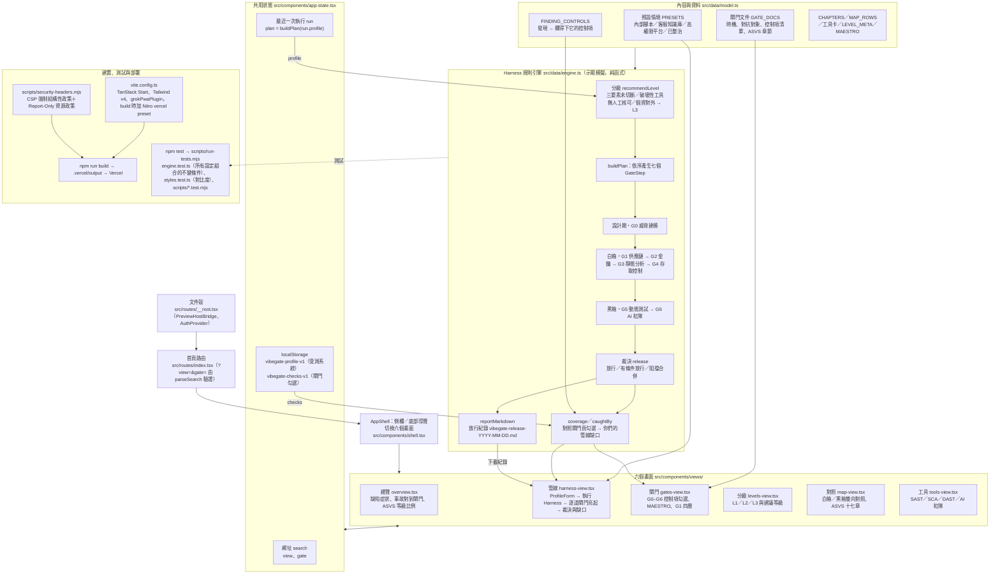

# 六扇門（Six-Gate for Vibe Code）

把 Vibe Coding 的資安測試整理成「G0 威脅建模 + G1–G6 六道閘門」的互動教學工具，對齊 OWASP ASVS 5.0.0。設計期、白箱、黑箱與 AI 紅隊各有一道關卡，Harness 把它們串成一次放行裁決。

> Harness 是**示範模擬**：發現項與證據是依你選的情境產生的教學範例，不會掃描任何真實系統。章節對照是教學摘要，正式驗證以標準原文為準。

## 🏛️ 系統架構與流程 (Architecture Overview)

整個系統跑在瀏覽器裡：TanStack Start 負責殼與路由，`app-state.tsx` 管狀態，`model.ts` 放內容，`engine.ts` 是 Harness 的純函式規則引擎。沒有後端、沒有模型呼叫、不掃描任何真實系統。



> Harness 的發現項與證據是依情境產生的教學範例，實際放行要接你們自己的 SAST、SCA、DAST 與紅隊結果。

## 畫面

| 畫面 | 內容 |
| --- | --- |
| 總覽 | 會被 AI 生成速度放大的缺陷、事故對到閘門、ASVS 5.0 等級比例 |
| 管線 | 設定受測系統，執行 Harness，看各閘門裁決、放行紀錄與「你們的管線缺口」 |
| 閘門 | G0–G6 的時機、對抗對象與控制項清單；勾選代表你們真實的管線已有該控制 |
| 分級 | L1／L2／L3 的意義、建議等級與在 Harness 裡的效果 |
| 對照 | 白箱與黑箱的雙向對照，以及 ASVS 十七章 |
| 工具 | SAST、SCA、DAST、AI 紅隊工具的定位與限制 |

畫面與閘門寫在網址裡（例如 `?view=gates&gate=G3`），可以直接分享。受測系統設定與勾選只存在瀏覽器的 localStorage。

## Harness 的規則

規則都在 `src/data/engine.ts`，重點如下：

- **分級**：對外且有個資、致命三要素未切斷、破壞性工具沒有人工核可，任一項成立就是 L3；有個資、有 LLM、超出內部使用或有 Agent 則是 L2；其餘 L1。
- **致命三要素**（私有資料、不受信任內容、對外通訊）只在有 LLM 或 Agent 時成立。沙箱或出向允許清單可以切斷一腳，人工核可不算。未切斷時 G0 與 G6 都阻擋。
- **破壞性工具**只認人工核可，沙箱不能取代。
- **示範程式的狀態**分三段：仍有缺陷、剩縱深項（只剩 CSP 強制、重設密碼限速這類警示）、已整治。
- **L3 的縱深項**（IMDSv2、CSP、規則檔掃描、速率限制、配額）一律升為阻擋；L1／L2 只警示。
- **管線缺口**：每個發現都對到攔得下它的控制項（`FINDING_CONTROLS`），任一項在閘門頁已勾就算你們的管線涵蓋。

## 📦 目錄結構

```text
G0withSixGates/
├── src/
│   ├── routes/
│   │   ├── __root.tsx              # 文件殼：head、樣式、<PreviewHostBridge />、<AuthProvider>
│   │   └── index.tsx               # 唯一頁面；以 parseSearch 驗證 ?view=&gate=，掛上 AppShell
│   ├── components/
│   │   ├── shell.tsx               # AppShell：標頭、側欄與底部導覽，依 view 切換畫面
│   │   ├── app-state.tsx           # 共用狀態：網址參數、localStorage 存檔、最近一次執行與 plan
│   │   ├── profile-form.tsx        # 受測系統設定表單（預設情境、暴露面、LLM／Agent、三要素、緩解）
│   │   ├── ui.tsx                  # Panel、Badge、按鈕、Choice、ToggleRow 等基礎元件
│   │   ├── preview-host-bridge.tsx # 平台：Grok 即時預覽的 postMessage 橋接
│   │   └── views/                  # 六個畫面
│   │       ├── overview.tsx        #   總覽：缺陷症狀、事故對到閘門、ASVS 等級比例
│   │       ├── harness-view.tsx    #   管線：執行 Harness、逐道閘門亮起、裁決、缺口、下載紀錄
│   │       ├── gates-view.tsx      #   閘門：G0–G6 控制項勾選、MAESTRO 七層、G1 四層
│   │       ├── levels-view.tsx     #   分級：L1／L2／L3 的意義與建議等級
│   │       ├── map-view.tsx        #   對照：白箱與黑箱雙向對照、ASVS 十七章
│   │       └── tools-view.tsx      #   工具：SAST、SCA、DAST、AI 紅隊工具的定位與限制
│   ├── data/
│   │   ├── model.ts                # 內容與資料：閘門、控制項、ASVS 章節、對照表、工具、等級、預設情境
│   │   ├── engine.ts               # Harness 規則：分級、各閘門的發現、裁決、管線涵蓋、放行紀錄
│   │   └── engine.test.ts          # 規則測試，含對所有設定組合的不變條件檢查
│   ├── lib/                        # 平台預置的 Postgres／Better Auth／連接器助手；本 app 未啟用 auth 與 db
│   │   ├── auth/                   #   Better Auth 伺服端與用戶端、Grok 閘道登入
│   │   ├── app-data/               #   檢視者連接器資料（app-data 技能）
│   │   ├── db.ts、env.server.ts    #   資料庫與環境變數
│   │   ├── og/site.json            #   分享卡片設定
│   │   └── multiplayer/            #   P2P 多人連線助手（未使用）
│   ├── styles.css                  # Tailwind v4 與色彩 tokens
│   ├── styles.test.ts              # 檢查文字與元件對比度
│   ├── router.tsx                  # getRouter()，掛上錯誤畫面
│   ├── routeTree.gen.ts            # TanStack Router 自動產生
│   └── zod-jitless.ts              # 平台：zod 設定
├── scripts/
│   ├── run-tests.mjs               # npm test：逐組跑 scripts/*.test.mjs 與 src/**/*.test.ts
│   ├── security-headers.mjs        # 正式建置的安全標頭（CSP、HSTS 等），寫進 Vercel 輸出設定
│   ├── with-app-env.mjs            # 讓 npm scripts 帶入 .grok/app-env.json 再啟動 Vite
│   ├── browser-smoke.mjs           # 桌機與手機的渲染檢查（Playwright）
│   ├── migrate.mjs、migration-plan.mjs # 建置後套用 migrations（本 app 只有平台的 auth 表）
│   ├── grok-pwa-plugin.mjs、grok-pwa-shared.mjs # 平台：PWA head 與「Created with Grok」標章
│   └── *.test.mjs                  # 以上腳本的測試
├── server/
│   └── middleware/grok-pwa.ts      # 平台：Nitro 中介層（PWA 安裝頁、manifest）
├── public/
│   ├── favicon.svg、og.jpg         # 圖示與分享卡片
│   ├── fonts/                      # IBM Plex Sans／Mono
│   └── __grok/                     # 平台：PWA 圖示與安裝教學
├── migrations/
│   └── auth/0001_auth.sql          # 平台：Better Auth 資料表（本 app 未使用）
├── attachments/                    # 參考資料：ASVS 5.0.0 原文（docx）與心智圖。兩份課程筆記 PDF 與威脅模型圖 GIF 只留在本機，不進版控
├── screenshots/                    # browser-smoke 的截圖輸出，只保留目錄
├── .grok/                          # 平台：app-env.json、references/、skills/（給 Grok 代理的合約與技能）
├── AGENTS.md                       # 平台：Grok App Builder 的工作合約
├── startup.sh                      # 平台：Grok 沙箱重啟時的啟動腳本（路徑固定為 /workspace）
├── vite.config.ts                  # Vite：TanStack Start、Tailwind、PWA 插件；build 時加 Nitro vercel preset 與安全標頭
├── vercel.json                     # 部署時只安裝正式依賴
├── eslint.config.mjs、.prettierrc、tsconfig.json
└── package.json                    # Node 22；dev／build／test／typecheck／lint
```

## 開發

需要 Node 22。

```sh
npm ci
npm run dev        # http://localhost:8080
npm test           # 規則引擎、對比度與模板腳本的測試
npm run typecheck
npm run lint
npm run build      # 產出 .vercel/output（不進版控）
```

`npm test` 由 `scripts/run-tests.mjs` 執行：每組測試各自跑，任何一組失敗就回傳非 0；`src/**/*.test.ts` 會自動被找到。

## 安全標頭

正式建置會在 Vercel 的輸出設定裡加上安全標頭（`scripts/security-headers.mjs`）；開發伺服器與 Grok 即時預覽不受影響。

- **強制**：`frame-ancestors`（只允許自己與 Grok 嵌入）、`object-src 'none'`、`base-uri`、`form-action`，以及 `X-Content-Type-Options`、`Referrer-Policy`、`Permissions-Policy`、`Strict-Transport-Security`。
- **先觀察**：腳本、樣式、連線等來源限制以 `Content-Security-Policy-Report-Only` 送出，因為 Grok 標章腳本的內容無法事先檢視。上線後確認「Created with Grok」標章正常、瀏覽器 console 沒有 CSP 報告，再把 `ENFORCE_RESOURCE_POLICY` 改成 `true`。
- `script-src` 保留 `'unsafe-inline'`：TanStack Start 的 hydration 腳本每頁內容不同，無法用雜湊放行。

## 平台檔案

這個專案用 Grok App Builder 建立，部署時由平台在 Vercel 上執行 `npm run build`。以下檔案屬於平台，不要刪除或改寫：

- `AGENTS.md` 與 `.grok/`：給 Grok 代理的工作合約、技能與 `app-env.json`
- `public/__grok/`、`server/`、`scripts/grok-pwa-*`：PWA 與「Created with Grok」標章
- `startup.sh`：Grok 沙箱重啟時用的啟動腳本（路徑固定為 `/workspace`，本機用不到）
- `src/routes/__root.tsx` 裡的 `<PreviewHostBridge />`

## 資料來源

內容依 OWASP ASVS 5.0.0（共 345 項要求：L1 70 項、L2 再加 183 項、L3 再加 92 項）整理。統計數字與事故案例來自課程教材整理的公開研究，對外引用前請回查原始論文與廠商方法。
