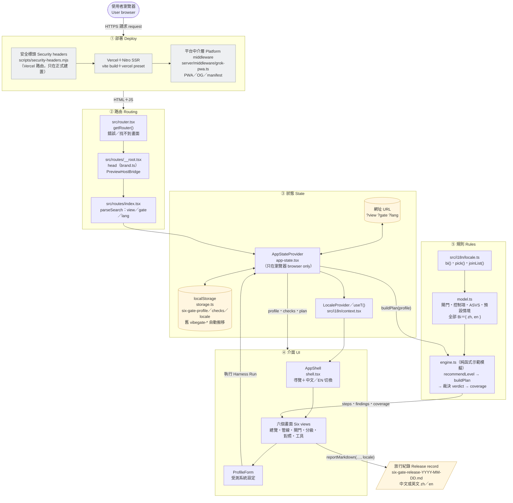
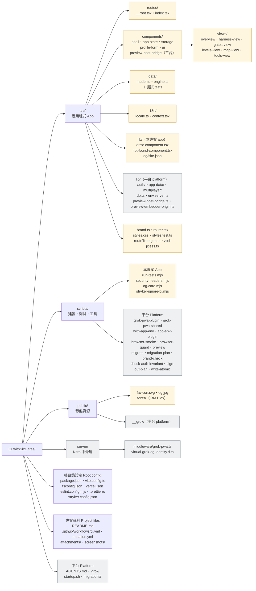

# 六扇門（Six-Gate for Vibe Code）

> 本文件中英對照：每一節先正體中文、後 English。
> This document is bilingual: each section is written in Traditional Chinese first, then in English.

把 Vibe Coding 的資安測試整理成「G0 威脅建模 + G1–G6 六道閘門」的互動教學工具，對齊 OWASP ASVS 5.0.0。設計期、白箱、黑箱與 AI 紅隊各有一道關卡，Harness 把它們串成一次放行裁決。介面提供正體中文與英文切換（預設中文）。

An interactive teaching tool that organizes security testing for vibe coding into "G0 threat modeling + six gates G1–G6", aligned with OWASP ASVS 5.0.0. Design-time, white-box, black-box and AI red-team each get a gate, and the Harness chains them into one release verdict. The UI switches between Traditional Chinese and English (Chinese by default).

> Harness 是**示範模擬**：發現項與證據是依你選的情境產生的教學範例，不會掃描任何真實系統。章節對照是教學摘要，正式驗證以標準原文為準。
>
> The Harness is a **demo simulation**: findings and evidence are teaching examples generated from the scenario you pick; nothing real is scanned. Chapter references are a teaching summary; verify against the standard itself.

## 🏛️ 系統架構與流程 / Architecture Overview

整個 App 在瀏覽器裡執行：伺服器端只負責 SSR 與平台的 PWA 中介層，沒有自己的 API、沒有模型呼叫，也不掃描任何真實系統。下圖由上而下是一次請求經過的五層，灰色是平台元件，米色是資料與輸出。

The app runs in the browser: the server side only does SSR plus the platform's PWA middleware. There is no API of its own, no model call and no real scanning. Top to bottom, the diagram shows the five layers a request passes through; grey boxes are platform components, beige boxes are data and output.



**流程 / Flow**

1. **部署 Deploy**：Vercel 回應前先套用安全標頭（只在正式建置），Nitro 做 SSR，平台中介層注入 PWA 與分享卡片標記。
   Vercel applies the security headers (production builds only), Nitro renders server-side, and the platform middleware injects PWA and share-card tags.
2. **路由 Routing**：`getRouter()` 掛上錯誤與找不到畫面；`__root.tsx` 輸出 head 與 `PreviewHostBridge`；`index.tsx` 以 `parseSearch` 只留下合法的 `view`、`gate`、`lang`。
   `getRouter()` wires the error and not-found screens; `__root.tsx` renders the head and `PreviewHostBridge`; `index.tsx` keeps only valid `view`, `gate` and `lang` via `parseSearch`.
3. **狀態 State**：`AppStateProvider` 讀寫網址參數，經 `storage.ts` 安全讀寫 localStorage（含舊 `vibegate-*` 鍵搬移），並決定語系交給 `LocaleProvider`。
   `AppStateProvider` reads and writes the URL params, persists to localStorage through `storage.ts` (including the `vibegate-*` migration), and hands the locale to `LocaleProvider`.
4. **介面 UI**：`AppShell` 提供導覽與中文／EN 切換；在「管線」畫面按下執行 Harness，`ProfileForm` 的設定交回狀態層。
   `AppShell` provides navigation and the 中文 / EN switch; pressing Run on the Pipeline view sends the `ProfileForm` settings back to state.
5. **規則 Rules**：`engine.ts` 以純函式 `recommendLevel → buildPlan` 產生七道閘門的結果與裁決，`coverage` 對照閘門頁勾選算出管線缺口；內容全部來自 `model.ts` 的雙語 `Bi`。
   `engine.ts` runs the pure `recommendLevel → buildPlan` to produce the seven gate results and the verdict, and `coverage` compares them with the gates-page checks to find pipeline gaps; all content is bilingual `Bi` from `model.ts`.
6. **輸出 Output**：`reportMarkdown(…, locale)` 依目前語系產生 `six-gate-release-YYYY-MM-DD.md` 供下載。
   `reportMarkdown(…, locale)` writes `six-gate-release-YYYY-MM-DD.md` in the current locale for download.

> Harness 的發現項與證據是依情境產生的教學範例，實際放行要接你們自己的 SAST、SCA、DAST 與紅隊結果。
>
> Harness findings and evidence are teaching examples; a real release plugs in your own SAST, SCA, DAST and red-team results.

## 畫面 / Views

| 畫面 View | 內容 Content |
| --- | --- |
| 總覽 Overview | 會被 AI 生成速度放大的缺陷、事故對到閘門、ASVS 5.0 等級比例<br/>Defects that generation speed amplifies, incidents mapped to gates, ASVS 5.0 level shares |
| 管線 Pipeline | 設定受測系統，執行 Harness，看各閘門裁決、放行紀錄與「你們的管線缺口」<br/>Configure the system under test, run the Harness, see each gate's verdict, the release record and "your pipeline gaps" |
| 閘門 Gates | G0–G6 的時機、對抗對象與控制項清單；勾選代表你們真實的管線已有該控制<br/>When each of G0–G6 runs, what it defends against, its control checklist; a check means your real pipeline has that control |
| 分級 Levels | L1／L2／L3 的意義、建議等級與在 Harness 裡的效果<br/>What L1 / L2 / L3 mean, the recommended level and its effect in the Harness |
| 對照 Map | 白箱與黑箱的雙向對照，以及 ASVS 十七章<br/>The two-way white-box / black-box map and the seventeen ASVS chapters |
| 工具 Tools | SAST、SCA、DAST、AI 紅隊工具的定位與限制<br/>Where SAST, SCA, DAST and AI red-team tools fit, and their limits |

畫面、閘門與語系寫在網址裡（例如 `?view=gates&gate=G3&lang=en`），可以直接分享；中文是預設值，不會出現在網址。受測系統設定、勾選與語系只存在瀏覽器的 localStorage，舊版 `vibegate-*` 鍵會在第一次載入時自動搬到 `six-gate-*`。

View, gate and locale live in the URL (for example `?view=gates&gate=G3&lang=en`) so links can be shared; Chinese is the default and stays out of the URL. The system settings, checks and locale are stored only in the browser's localStorage; the old `vibegate-*` keys are migrated to `six-gate-*` on first load.

## 雙語怎麼做 / How the bilingual UI works

所有顯示文字都是 `Bi = { zh, en }`（`src/i18n/locale.ts`）。內容（`model.ts`）、規則引擎輸出（`engine.ts` 的發現、日誌、裁決、放行紀錄）與各畫面頂端的 `T` 字典全部成對儲存，型別會強制兩種語言都有。畫面用 `useT()` 取字；`reportMarkdown` 多一個 `locale` 參數。語系來源依序是網址 `?lang=`、localStorage、預設中文，切換時同步 `<html lang>`。

Every display string is a `Bi = { zh, en }` (`src/i18n/locale.ts`). Content (`model.ts`), rule-engine output (findings, logs, verdicts and the release record in `engine.ts`) and the per-view `T` dictionaries are all stored as pairs, and the type forces both languages. Views call `useT()`; `reportMarkdown` takes an extra `locale` argument. The locale comes from `?lang=` in the URL, then localStorage, then the Chinese default, and `<html lang>` follows it.

## Harness 的規則 / Harness rules

規則都在 `src/data/engine.ts`，重點如下：

- **分級**：對外且有個資、致命三要素未切斷、破壞性工具沒有人工核可，任一項成立就是 L3；有個資、有 LLM、超出內部使用或有 Agent 則是 L2；其餘 L1。
- **致命三要素**（私有資料、不受信任內容、對外通訊）只在有 LLM 或 Agent 時成立。沙箱或出向允許清單可以切斷一腳，人工核可不算。未切斷時 G0 與 G6 都阻擋。
- **破壞性工具**只認人工核可，沙箱不能取代。
- **示範程式的狀態**分三段：仍有缺陷、剩縱深項（只剩 CSP 強制、重設密碼限速這類警示）、已整治。
- **L3 的縱深項**（IMDSv2、CSP、規則檔掃描、速率限制、內部端點的配額）一律升為阻擋；L1／L2 只警示。公開端點完全沒有配額則不分等級都阻擋；預備環境的 API 文件外洩不是縱深項，各等級都維持警示。
- **未文件化的威脅模型**在 L3 阻擋，其他等級警示。
- **管線缺口**：每個發現都對到攔得下它的控制項（`FINDING_CONTROLS`），任一項在閘門頁已勾就算你們的管線涵蓋。

The rules live in `src/data/engine.ts`:

- **Level**: public with personal data, an uncut lethal trifecta, or destructive tools without human approval each force L3; personal data, an LLM, exposure beyond internal use or an agent give L2; everything else is L1.
- **Lethal trifecta** (private data, untrusted content, egress) only counts with an LLM or agent. A sandbox or egress allow-list cuts a leg; human approval does not. While uncut, G0 and G6 both block.
- **Destructive tools** accept only human approval; a sandbox is no substitute.
- **Demo code state** has three stages: still defective, depth items left (only advisories such as enforced CSP and password-reset rate limits), remediated.
- **Depth items at L3** (IMDSv2, CSP, rule-file scanning, rate limits, quotas on internal endpoints) escalate to blocks; L1 / L2 only warn. A public endpoint with no quota at all blocks at every level; API docs exposed in staging are not a depth item and stay an advisory at every level.
- **An undocumented threat model** blocks at L3 and warns elsewhere.
- **Pipeline gaps**: every finding maps to the controls that would catch it (`FINDING_CONTROLS`); any one checked on the gates page counts as covered.

## 📦 目錄結構 / Directory layout

儲存庫名稱仍是 `G0withSixGates`，產品名稱是「六扇門 Six-Gate for Vibe Code」（`package.json` 的 name 為 `six-gate-for-vibe-code`）。下圖米色是本專案自己的程式，灰色是 Grok App Builder 平台檔案（不要刪改）。

The repository is still called `G0withSixGates`; the product is "六扇門 Six-Gate for Vibe Code" (`package.json` name `six-gate-for-vibe-code`). Beige boxes are this project's own code; grey boxes are Grok App Builder platform files (do not delete or rewrite them).



<details>
<summary>完整檔案清單 / Full file list</summary>

```text
G0withSixGates/
├── .github/workflows/ci.yml        # CI：typecheck → lint → test → build
├── .github/workflows/mutation.yml  # 突變測試，只在手動觸發時執行 / mutation testing, manual trigger only
├── .grok/                          # 平台 platform：app-env.json、references/、skills/
├── AGENTS.md                       # 平台 platform：Grok App Builder 工作合約
├── README.md
├── attachments/                    # ASVS 5.0.0 原文 docx、心智圖 JSON（PDF、GIF 不進版控）
├── migrations/auth/0001_auth.sql   # 平台 platform：Better Auth 資料表（本 app 未使用）
├── public/
│   ├── favicon.svg
│   ├── og.jpg                      # 分享卡片，由 scripts/og-card.mjs 產生 / share card
│   ├── fonts/                      # IBM Plex Sans 400/500/600、Mono 400/500
│   └── __grok/                     # 平台 platform：PWA 圖示與安裝教學
├── screenshots/.gitkeep            # browser-smoke 截圖輸出，只保留目錄
├── scripts/
│   ├── run-tests.mjs               # 本專案 app：npm test
│   ├── security-headers.mjs(.test.mjs)   # 本專案 app：正式建置安全標頭
│   ├── og-card.mjs                 # 本專案 app：重製 public/og.jpg
│   ├── stryker-ignore-bi.mjs       # 本專案 app：突變測試忽略 bi() 內的內容字串 / mutation ignore plugin
│   ├── app-env-plugin.mjs、with-app-env.mjs(.test.mjs)          # 平台 platform
│   ├── browser-smoke.mjs、browser-smoke-verdict.mjs(.test.mjs)、browser-guard.mjs
│   ├── preview.mjs(.test.mjs)、preview-thumbnail.mjs
│   ├── migrate.mjs、migration-plan.mjs(.test.mjs)
│   ├── brand-check.mjs(.test.mjs)、check-auth-invariant.mjs(.test.mjs)
│   ├── sign-out-plan.mjs(.test.mjs)、write-atomic.mjs(.test.mjs)
│   └── grok-pwa-plugin.mjs(.test.mjs)、grok-pwa-shared.mjs、grok-pwa-shared.d.mts、install-page.html
├── server/                         # 平台 platform
│   ├── middleware/grok-pwa.ts      # Nitro 中介層：PWA 安裝頁、manifest、OG 標記
│   └── virtual-grok-og-identity.d.ts
├── src/
│   ├── brand.ts                    # 專案名稱與說明 / name and description
│   ├── router.tsx                  # getRouter()：錯誤與找不到畫面
│   ├── routeTree.gen.ts            # TanStack Router 自動產生 / generated
│   ├── styles.css、styles.test.ts  # Tailwind v4 色彩 tokens、對比度測試
│   ├── zod-jitless.ts              # 關閉 zod JIT（CSP 不允許 eval）
│   ├── routes/__root.tsx、index.tsx
│   ├── i18n/locale.ts(.test.ts)、context.tsx
│   ├── data/model.ts(.test.ts)、engine.ts(.test.ts)
│   ├── components/
│   │   ├── shell.tsx、app-state.tsx、profile-form.tsx、ui.tsx
│   │   ├── storage.ts(.test.ts)
│   │   ├── preview-host-bridge.tsx # 平台 platform
│   │   └── views/overview.tsx、harness-view.tsx、gates-view.tsx、levels-view.tsx、map-view.tsx、tools-view.tsx
│   └── lib/
│       ├── error-component.tsx、not-found-component.tsx、og/site.json   # 本專案 app
│       └── auth/、app-data/、multiplayer/、db.ts、env.server.ts、preview-host-bridge.ts、preview-embedder-origin.ts   # 平台 platform
├── startup.sh                      # 平台 platform：沙箱重啟腳本（/workspace）
├── package.json、package-lock.json # Node ≥ 22.6
├── vite.config.ts、tsconfig.json、vercel.json、eslint.config.mjs、.prettierrc
├── stryker.config.json             # 突變測試設定（預設不跑）/ mutation-testing config (off by default)
└── .gitignore
```

</details>

## 開發 / Development

需要 Node 22.6 以上（`package.json` 的 `engines` 有標；測試用 `--experimental-strip-types` 直接跑 TypeScript）。

Node 22.6 or later is required (`engines` in `package.json`; tests run TypeScript directly with `--experimental-strip-types`).

```sh
npm ci
npm run dev              # 開發伺服器 dev server：http://localhost:8080
npm test                 # 規則引擎、雙語內容、儲存搬移、對比度、腳本與平台測試 / all test suites
npm run typecheck
npm run lint
npm run build            # 產出 .vercel/output（不進版控），接著跑 db:migrate（沒有 DATABASE_URL 會略過）
npm run preview:restart  # 以 127.0.0.1:8081 預覽正式建置 / preview the production build
node scripts/browser-smoke.mjs   # 桌機與手機渲染檢查 / desktop + mobile render check
node scripts/og-card.mjs         # 重製分享卡片 public/og.jpg / regenerate the share card
npm run test:mutation            # 突變測試，預設不跑，見下節 / mutation testing, off by default, see below
```

其他 scripts：`build:dev`、`preview`、`preview:stop`、`db:migrate`、`check:auth`、`format`。

Other scripts: `build:dev`, `preview`, `preview:stop`, `db:migrate`, `check:auth`, `format`.

### 突變測試 / Mutation testing

**預設關閉。** `npm test` 與每次 PR 的 CI 都不跑突變測試；要跑有兩種方式：本機執行 `npm run test:mutation`，或在 GitHub 的 Actions 分頁手動觸發「Mutation testing」工作流程（報告會上傳成 artifact）。

- 工具是 [StrykerJS](https://stryker-mutator.io/)，完全在本機執行，不需要外部服務或金鑰。
- 只突變純函式邏輯：`src/data/engine.ts`（規則引擎）、`src/components/storage.ts`（儲存搬移）、`src/i18n/locale.ts`（雙語工具）。`model.ts` 幾乎全是內容資料，不列入。
- `scripts/stryker-ignore-bi.mjs` 會跳過 `bi("中文", "English")` 裡的顯示文字；測試不該逐句斷言文案，留著只會灌水存活突變體。其他字串（例如 `=== "public"`）照常突變。
- 每個突變體都要重跑一次邏輯測試（約 2 秒），七百多個突變體以 4 個並行約需十幾分鐘，所以不放進每次 PR 的流程。
- 設定在 `stryker.config.json`；`thresholds.break` 為 `null`，分數低不會讓指令失敗，報告在 `reports/mutation/index.html`（不進版控）。存活的突變體就是測試沒有鎖住的行為，依此補測試或接受它。

**Off by default.** Neither `npm test` nor the per-PR CI runs mutation testing. Run it locally with `npm run test:mutation`, or trigger the "Mutation testing" workflow by hand from the Actions tab on GitHub (the report is uploaded as an artifact).

- The tool is [StrykerJS](https://stryker-mutator.io/); it runs entirely locally with no external service or key.
- Only pure logic is mutated: `src/data/engine.ts` (rule engine), `src/components/storage.ts` (storage migration), `src/i18n/locale.ts` (locale helpers). `model.ts` is almost all content data and is left out.
- `scripts/stryker-ignore-bi.mjs` skips the display text inside `bi("中文", "English")`; tests should not assert on every sentence, and keeping those mutants only inflates the survivor count. Other strings (such as `=== "public"`) are still mutated.
- Every mutant reruns the logic tests (about 2 seconds); seven hundred-odd mutants at 4-way concurrency take ten-plus minutes, so it stays out of the per-PR pipeline.
- Configuration lives in `stryker.config.json`; `thresholds.break` is `null`, so a low score never fails the command, and the report lands in `reports/mutation/index.html` (not tracked). Surviving mutants are behaviour the tests do not pin down: add a test or accept them.

`npm test` 由 `scripts/run-tests.mjs` 執行：`scripts/*.test.mjs` 與 `src/**/*.test.ts`（含 `src/lib` 下的平台測試）合跑一次，`grok-pwa-plugin.test.mjs` 另外在空目錄跑一次；任何一組失敗就回傳非 0。新增的 `*.test.ts` 會自動被找到。

`npm test` runs through `scripts/run-tests.mjs`: `scripts/*.test.mjs` and `src/**/*.test.ts` (including the platform tests under `src/lib`) run in one pass, and `grok-pwa-plugin.test.mjs` runs separately from an empty directory; any failing suite returns non-zero. New `*.test.ts` files are discovered automatically.

## 安全標頭 / Security headers

正式建置會在 Vercel 的輸出設定裡加上安全標頭（`scripts/security-headers.mjs`）；開發伺服器與 Grok 即時預覽不受影響。

- **強制**：`frame-ancestors`（只允許自己與 Grok 嵌入）、`object-src 'none'`、`base-uri`、`form-action`，加上 `default-src`、`script-src`、`style-src`、`img-src`、`font-src`、`connect-src`、`frame-src`、`manifest-src`、`worker-src` 等資源來源限制（只允許自己與 Grok），以及 `X-Content-Type-Options`、`Referrer-Policy`、`Permissions-Policy`、`Strict-Transport-Security`。
- `script-src` 保留 `'unsafe-inline'`：TanStack Start 的 hydration 腳本每頁內容不同，無法用雜湊放行。
- `ENFORCE_RESOURCE_POLICY` 已設為 `true`。Grok 標章腳本的內容無法事先檢視，所以**每次部署後請確認「Created with Grok」標章正常、瀏覽器 console 沒有 CSP 違規**；若標章被擋，把旗標改回 `false` 就會退回觀察模式（資源限制改以 `Content-Security-Policy-Report-Only` 回報）。

The production build adds security headers to the Vercel output config (`scripts/security-headers.mjs`); the dev server and the Grok live preview are unaffected.

- **Enforced**: `frame-ancestors` (self and Grok only), `object-src 'none'`, `base-uri`, `form-action`, plus the resource limits `default-src`, `script-src`, `style-src`, `img-src`, `font-src`, `connect-src`, `frame-src`, `manifest-src` and `worker-src` (self and Grok only), and `X-Content-Type-Options`, `Referrer-Policy`, `Permissions-Policy` and `Strict-Transport-Security`.
- `script-src` keeps `'unsafe-inline'`: TanStack Start's hydration script differs on every page, so hashes cannot cover it.
- `ENFORCE_RESOURCE_POLICY` is now `true`. The Grok badge script cannot be inspected in advance, so **after every deploy check that the "Created with Grok" badge works and the browser console shows no CSP violations**; if the badge is blocked, set the flag back to `false` to return to observation mode (the resource limits go back to `Content-Security-Policy-Report-Only`).

## 平台檔案 / Platform files

這個專案用 Grok App Builder 建立，部署時由平台在 Vercel 上執行 `npm run build`。以下檔案屬於平台，不要刪除或改寫（本次雙語化也不動它們）：

- `AGENTS.md` 與 `.grok/`：給 Grok 代理的工作合約、技能與 `app-env.json`
- `public/__grok/`、`server/`、`scripts/grok-pwa-*`：PWA 與「Created with Grok」標章
- `src/lib/` 下的 auth、app-data、db、multiplayer 助手與 `migrations/`：本 app 未啟用 auth 與 db；`.grok/app-env.json` 把 `VITE_AUTH_ENABLED` 設為 `"false"`，但部署端的旗標由平台決定（見 `scripts/with-app-env.mjs`），上線後請確認
- `startup.sh`：Grok 沙箱重啟時用的啟動腳本（路徑固定為 `/workspace`，本機用不到）
- `src/routes/__root.tsx` 裡的 `<PreviewHostBridge />`

This project was created with Grok App Builder; the platform runs `npm run build` on Vercel at deploy time. The following files belong to the platform and must not be deleted or rewritten (the bilingual pass leaves them untouched):

- `AGENTS.md` and `.grok/`: the Grok agent's contract, skills and `app-env.json`
- `public/__grok/`, `server/`, `scripts/grok-pwa-*`: PWA and the "Created with Grok" badge
- The auth, app-data, db and multiplayer helpers under `src/lib/` and `migrations/`: auth and db are off in this app; `.grok/app-env.json` sets `VITE_AUTH_ENABLED` to `"false"`, but the deployed flag is the platform's (see `scripts/with-app-env.mjs`), so check it after deploy
- `startup.sh`: the restart script for the Grok sandbox (hard-coded to `/workspace`; unused locally)
- `<PreviewHostBridge />` in `src/routes/__root.tsx`

## 資料來源 / Sources

內容依 OWASP ASVS 5.0.0（共 345 項要求：L1 70 項、L2 再加 183 項、L3 再加 92 項）整理。統計數字與事故案例來自課程教材整理的公開研究，對外引用前請回查原始論文與廠商方法。

Content follows OWASP ASVS 5.0.0 (345 requirements: 70 at L1, 183 more at L2, 92 more at L3). Statistics and incidents come from public research summarized in the course material; check the original papers and vendor methods before citing them.
